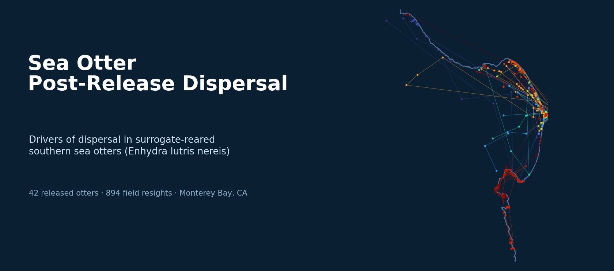

# seaotter_dispersal

Data and code for **"Environmental Factors May Drive the Post-release Movements of Surrogate-Reared Sea Otters,"** published open access in *Frontiers in Marine Science* (2020).

[](https://doi.org/10.3389/fmars.2020.539904)
[](LICENSE)
[](https://www.r-project.org/)

> Becker SL†, Nicholson TE†, Mayer KA, Murray MJ, Van Houtan KS (2020) Environmental factors may drive the post-release movements of surrogate-reared sea otters. *Frontiers in Marine Science* 7:539904. https://doi.org/10.3389/fmars.2020.539904
>
> *Monterey Bay Aquarium, Monterey, CA, USA; Nicholas School of the Environment, Duke University, Durham, NC, USA. †S.L. Becker and T.E. Nicholson contributed equally.*

This repository builds on code originally written by **Sarah Becker** and **Teri Nicholson**.

---

## Abstract

Southern sea otters (*Enhydra lutris nereis*) are currently >80% depleted with respect to both abundance and range occupancy baselines, challenging the long-term persistence of the species and the ecosystem benefits their populations might provide. From 2001 to 2018, the Monterey Bay Aquarium rescued stranded sea otter pups and reared them in captivity through a surrogacy program using non-releasable adult females. We gave 11,396 days of captive care to 56 otters, reintroduced them into the wild, and observed them over 894 total field days after release. This study describes the post-release movements of the 42 successfully released otters, quantifying their dispersal patterns and modeling environmental, demographic, and animal care influences through a machine learning framework. This random forest model specifically considers predictor variable correlation, accounts for individual and joint variable impacts, and evaluates robustness through sensitivity analyses. Heavy-tailed dispersal models best explained the (n = 641) daily movements of surrogate-reared otters, and the random forest outputs ranked population demography, population growth, and El Niño most significantly. Occasionally aided by recaptures, the scale of dispersals consistently declined after release, indicating successfully released otters stabilized their movements within three weeks in the wild. Our results show dispersal is an important metric for measuring the success of sea otter releases and suggest environmental factors (including climate) at release sites may determine the success of reintroduction programs.

---

## Study at a glance

| | |
|---|---|
| Program | Monterey Bay Aquarium sea otter surrogacy program, 2001–2018 |
| Captive care | 11,396 days to 56 stranded pups, reared by non-releasable surrogate dams |
| Releases analyzed | 42 successfully released otters; 894 field-observation days |
| Movements modeled | n = 641 daily post-release relocations |
| Dispersal model | Heavy-tailed (Cauchy) best fit vs. Rayleigh / Gamma by AICc |
| Top-ranked drivers | Population demography (pup ratio), population growth (5-yr trend), El Niño (ENSO/MEI) |
| Key finding | Dispersal scale declines after release; otters stabilize within ~3 weeks |

---

## Analytical workflow

The analysis proceeds in three stages, captured end-to-end in `scripts/master_branch_ver2.R`:

1. **Least-cost path (LCP) dispersal distances.** Sequential field resights for each otter are converted to movement distances around Monterey Bay. Because otters travel along the coast rather than across land, distances are computed as least-cost paths over a rasterized bay using a 16-direction transition matrix (`gdistance`, with geographic correction), falling back to straight-line (Euclidean) distance only for very short moves below the raster resolution (<55 m).

2. **Heavy-tailed dispersal modeling.** For every otter, the distribution of step distances is fit to **Cauchy**, **Rayleigh**, and **Gamma** models, and the candidates are compared by small-sample-corrected AICc. The heavy-tailed **Cauchy** consistently wins, and its **scale parameter** (with standard error) becomes the per-otter measure of dispersal magnitude.

3. **Random forest driver analysis.** The (log) Cauchy scale is regressed on a shortlist of environmental, demographic, and animal-care predictors using random forests. The pipeline performs leave-one-out cross-validation, ranks predictors by the increase in MSE when each is removed (variable importance), tunes `mtry`/`ntree`, and runs a 100-iteration sensitivity analysis that re-samples each otter's Cauchy scale from its fitted mean and SE. Population demography (pup ratio), population growth (5-year census trend), and El Niño (ENSO) rank highest.

---

## Repository structure

```
seaotter_dispersal/
├── otter_dispersal.Rproj      # RStudio project (anchors relative paths)
├── README.md
├── LICENSE                     # MIT
├── header.png                  # banner (resight map, built from data/)
├── scripts/
│   ├── master_branch_ver2.R    # streamlined LCP → distribution → random forest pipeline
│   ├── master_ver1.R           # comprehensive original workflow (maps, LCP, models)
│   └── exploratory/            # per-topic working scripts (see below)
├── data/                       # field, environmental, and spatial inputs
└── data_output/                # derived distances, model fits, and driver tables
```

---

## Data

### Animal records
| File | Contents |
|---|---|
| `otter_releases.csv` | Per-release metadata: sex, release number, year/month, release ATOS site, age at release/stranding |
| `ottersurrogates.csv` / `ottersurrogates.xlsx` | Otter-to-surrogate-dam pairing and first release date |
| `body_condition.csv` | Release weight, length, and body-condition index |
| `post_release_resights.csv` / `release_resights.csv` | Field resights — date, time, latitude/longitude, fix type and quality |
| `diet/` | Per-otter feeding records (`{otter}feedings.xls`) used to derive proportion of live prey |

### Population and environmental drivers
| File | Contents |
|---|---|
| `censusES1985_2018.csv`, `censusES1985_2017.csv`, `censusMON.csv` | Sea otter census series — density, **pup ratio**, and **5-year trend** (demography and growth predictors) |
| `census2017/`, `census2018/` | USGS range-wide census shapefiles |
| `ENSO_index.txt`, `ENSO_rank.txt` | Multivariate ENSO Index (MEI) values and ranks (El Niño predictor) |
| `PDO.txt`, `PDO2.txt` | Pacific Decadal Oscillation index |
| `EHS_Temp/` | Elkhorn Slough water-temperature records (sea-surface-temperature predictor) |
| `wind/` | NDBC buoy wind data (stations 46042, 46092) |

### Spatial layers (`data/GIS/`)
`coastline/` (central California baseline, `cencal_baseline.shp`), `bathy/` (bathymetry for least-cost paths), and `ATOS_polygon_teale83/` (the As-The-Otter-Swims alongshore referencing system). These drive the LCP transition surface and the resight maps.

---

## Scripts

**Canonical pipeline**

- `scripts/master_branch_ver2.R` — the streamlined, paper-aligned workflow: LCP distance calculation → Cauchy/Rayleigh/Gamma AICc comparison → Cauchy-scale fitting → random forest variable importance, R²/MSE, and parameter tuning.
- `scripts/master_ver1.R` — the comprehensive original (~2,600 lines): resight mapping, bathymetry-based least-cost paths (`marmap`), distribution fitting, and figure generation. Retained for full provenance.

**Exploratory scripts** (`scripts/exploratory/`) develop and cross-check individual components, including: least-cost paths (`least_cost_path.R`, `least_cost_path_master.R`); distribution and rate model fitting (`model_fitting_dist.R`, `model_fitting_rate.R`); random forests (`random_forest.R`, `random_forest_scaled.R`); environmental drivers (`environmental_metrics.R`, `wind.R`, `ehs_temp.R`); population context (`pop_growth_and_density_viz.R`, `census2018.R`); diet (`diet_var_comparison.R`); a GLM comparison (`glm.R`); and visualization (`visualization.R`, `recap_viz.R`, `sex_dispersal_comparison_viz.R`, `resights.R`). A shared `theme_themeo()` ggplot theme styles the figures.

## Outputs (`data_output/`)

Derived products that let you inspect results without rerunning the full pipeline: dispersal distances (`dd.csv`, `dd_EHS.csv`, `lcp_df_unnest.csv`), Cauchy fits and scales (`otter_cauchy_fits.csv`, `cauchy_scale.csv`, `dist_cauchy_plotting_df.csv`), model selection tables (`AIC_diff_dist.csv`, `AIC_diff_rate.csv`, `otter_model_fit_dist.csv`, `otter_model_fit_rate.csv`), the assembled random forest input table (`dispersal_drivers.csv`, `dispersal_drivers_EHS.csv` — joining release metadata, body condition, diet, SST, PDO, ENSO, and the Cauchy-scale response), release summaries (`release_metrics.csv`), diet summaries, and several `.rds` model/map objects.

---

## Reproducing the analysis

1. Install [R](https://www.r-project.org/) and open `otter_dispersal.Rproj`.
2. Install the package stack used across the pipeline:

   ```r
   install.packages(c(
     # spatial + least-cost paths
     "sf", "sp", "raster", "gdistance", "marmap", "rgdal",
     # distribution fitting
     "MASS", "VGAM", "fitdistrplus", "lubridate",
     # modeling + wrangling + viz
     "randomForest", "tidyverse", "ggplot2", "here", "knitr"
   ))
   ```
3. Run `scripts/master_branch_ver2.R` for the streamlined LCP → distribution → random forest workflow, or `scripts/master_ver1.R` for the full original analysis.

---

## Notes and known issues

Documented for transparency and future cleanup.

- **Hard-coded absolute paths.** The master scripts read and write from the original authors' machines — e.g. `C:/Otterdat/...`, `C:/Users/tnicholson/Documents/...` (Teri Nicholson), and `C:/Users/SBecker/Local-Git/...` (Sarah Becker). Repoint these to the local clone before running. Converting them to `.Rproj`-relative or `here::here()` paths is the main reproducibility fix.
- **Script inputs vs. committed filenames.** `master_branch_ver2.R` reads machine-local intermediates such as `post_release_resights_tn.csv`, `dispersal_driversdmc42.csv`, and `resightlcp.csv`, whereas the repository ships `data/post_release_resights.csv`, `data_output/dispersal_drivers.csv`, and the like. These names need to be reconciled to run end-to-end from the repo.
- **Mixed path conventions.** A few exploratory scripts (`sex_dispersal_comparison_viz.R`, `total_dist_days_tracked.R`) already use clean `here::here()` / relative `data_output/` paths — a good model for migrating the rest.
- **Random seed.** The random forest scripts do not set a seed, so individual runs vary slightly; the published robustness comes from the 100-iteration sensitivity analysis rather than a fixed seed. Add `set.seed()` for bit-for-bit reproducibility.
- **`body_condition.csv` duplicate column.** The header lists `weightkg` twice (release weight vs. the body-condition-index weight); disambiguating these names would reduce confusion downstream.
- **LICENSE year.** The MIT `LICENSE` reads `Copyright (c) 2026`; the paper was published in 2020.
- **Repository housekeeping.** An empty `scripts/.Rapp.history` is committed, and the bundled environmental rasters (`EHS_Temp/`, `wind/`) make the repo ~187 MB — candidates for `.gitignore` or Git LFS.

---

## License

Released under the MIT License — see [LICENSE](LICENSE). © Kyle Van Houtan.

## Contributors

Sarah L. Becker, Teri E. Nicholson, Karl A. Mayer, Michael J. Murray, and Kyle S. Van Houtan (Monterey Bay Aquarium). The dispersal and modeling code was originally written by Sarah Becker and Teri Nicholson.
